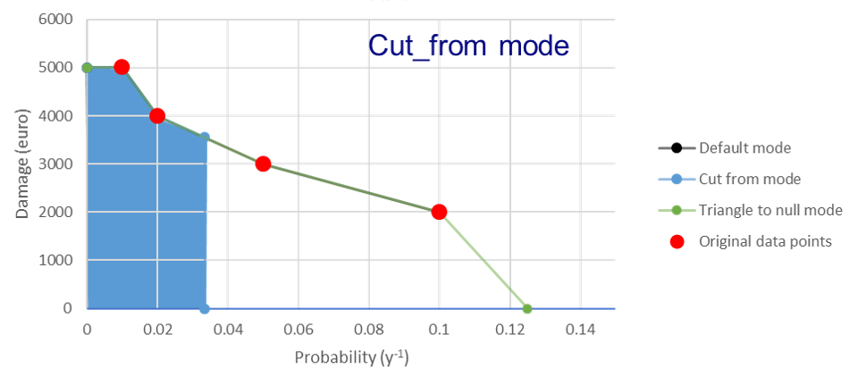
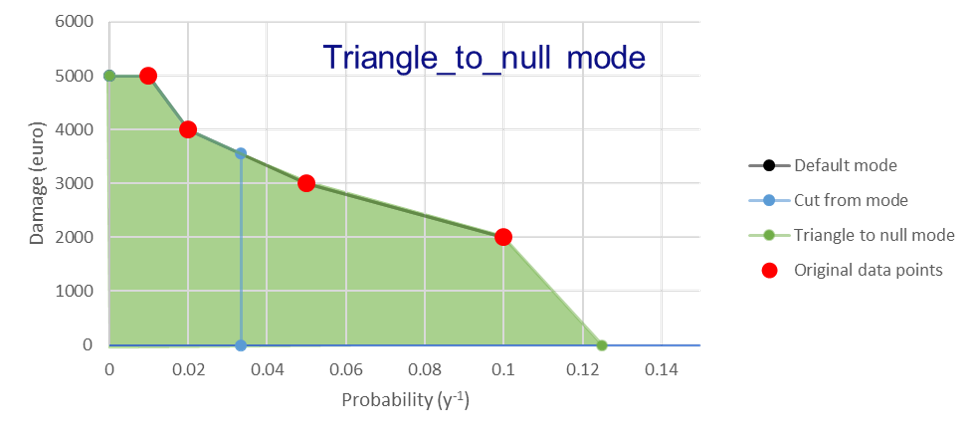

.. _analysis_module:

Analysis module
================
RA2CE's analysis module can perform several analyses on infrastructure networks. First, a network needs te be created. Visit the :ref:`network_module` for a better understanding of how this works. In the analysis module we distinguish a module focused on direct monetary road damages (damages) and an analysis module for network criticality and origin-destination analyses (losses). The latter are developed from a 'societal losses due to hazards' point of view and provide insight into the hazard impact on the network and the disruption of network services to society.

Configuration
-------------------------------------
Before describing the included analyses, we describe two main ways of setting-up the configurations needed for the analyses:

#. Creating ``.ini`` files for network and analysis. ``Ra2ceHandler.run_with_ini_files()`` should be used to create a handler instance, used to run analyses.
#. Instantiating the ``NetworkConfigData`` and ``AnalysisConfigData`` objects to pass required network and analysis configuration parameters (different for each analysis). ``Ra2ceHandler.run_with_config_data()`` should be used to create a handler instance, used to run analyses.

In the examples in this page the first approach is shown. In the example folders a few examples on the second approach is also given.

Damages
-------------------------------------
The physical *damage to the network* (referred to as damages here) depends on the intensity of the hazard in relation to how the network (and its assets) are built and its current condition (e.g. type, state of maintenance, dimensions). Here, the hazard intensity and asset condition are linked to a percentage of damage, via vulnerability functions/ fragility curves. To develop these vulnerability curves data is needed about replacements costs per asset type and the potential damage per hazard intensity. This data can be collected during a workshop with for example national road agencies and the technicians. The output of the analyses consist of damage maps per hazard (e.g. flooding, landslides), per return period or per event, per asset and per road segment.

Possible (built-in) options for vulnerability curves include:

- *Global*: Huizinga curves (HZ analysis name)
- *Europe*: OSdaMage functions (OSD analysis name)
- *Costume damage curves*: Manual function (MAN analysis name)

**Huizinga damage estimation**

For more information on the Huizinga damage functions please refer to *Global flood depth-damage functions: Methodology and the database with guidelines* written by Huizinga et al.

Here we explain the input, output, and main steps to perform the damage analysis based on this method.

The output consists of estimating the damages per each link and segment in two different output files. The unit of measurement is a currency, and the output type is gpkg. The generated columns in the result file include:

- Link-based damage output file:
    - damage_segments_list: A list of damages of all segments which comprise each link.
    - dam_<EVi>_HZ or dam_<RPj>_HZ (for event-based or return-period based analyses respectively): The total damage of each link.

- Segmented damage output file:
    - dam_<EVi>_HZ or dam_<RPj>_HZ (for event-based or return-period based analyses respectively): The total damage of each segment.

- For an analysis with hazards with return periods':
    - a risk column is also calculated which represents the risk or estimated annual losses of the included hazards (with return periods).

Here, EVi refers to each hazard map without a return period introduced in the network configuration, and RPj refers to each hazard map with a return period introduced in the network configuration.

The input requirements include:

- Hazard map:
    - with or without return period.
- Network:
    - Automatically downloading a network from the extent of the introduced hazard map.
    - Introducing a polygon representing the region of interest.
    - Introducing a Shapefile representing the network under study.
- Segmentation_length (metre):
    - If links have lengths above this, they will be segmented.

The main steps are:

#. Exposure Analysis:
    - Identifies the impacted links where the water depth exceeds the threshold.
#. Damage Estimation:
    #. Using Huizinga Vulnerability Curves:
    #. Determining the maximum damage value per meter for each road based on the road type and number of lanes. The maximum damage values per kilometer are defined by the Huizinga function.
    #. Relating water depth to the maximum damage value since water depth determines the actual amount of damage.
        - The maximum damage per kilometer (when a road is completely demolished) is converted to values per meter.
        - The relation between water depth levels and the estimated percentage of road damage is defined by the Huizinga curve. For instance, at a flood depth of 1.5m, the damage value is estimated to be 55% of the maximum damage for a specific road type with a certain number of lanes.
        - Calculate 55% of the maximum damage value per meter of the road.
        - Relate this value to the length of the road by multiplying the damage value per meter by the length fraction of the road that is actually damaged (inundated fraction * total length of the road).
    #. Finally, the damage value per meter of the road segment is multiplied by the length of the damaged segment.

**OSdamage damage estimation**

For more information on the Huizinga damage functions please refer to *Flood risk assessment of the European road network* written by van Ginkel et al.

The output (gpkg) consists of:

- Per link and segment (in Graph and Network objects, respectively):
    - Estimated damages as a tuple (quartile, in currency).
    - Representative damage for each damage curve. The representative percentage can be defined by the user (default is 100%). This percentage reflects a single value representing the damage between the lower and higher bounds (the tuple mentioned above).
- Generated columns in the result file:
    - Segmented damage output file (for event-based or return-period based analyses, respectively):
        - dam_<Ci>_<EVj>_quartiles or dam_<Ci>_<RPx>_quartiles: Tuple, damages between the lower and upper bounds for each segment and each damage curve.
        - dam_<Ci>_<EVj>_representative or dam_<Ci>_<RPx>_representative: representative_damage_percentile * max(dam_<Ci>_<EVj>_quartiles).
    - Link-based damage output file:
        - dam_<Ci>_<EVj>_representative or dam_<Ci>_<RPx>_representative: Sum of representative_damage_percentile * max(dam_<Ci>_<EVj>_quartiles) for all segments making up a road link.
        - damage_segments_list: A list of damages for all segments comprising each link.
    - For an analysis with hazards with return periods, a risk column is also calculated which represents the risk or estimated annual losses of the included hazards (with return periods).
    - Notes:
        - Ci refers to the 6 vulnerability curves in the OSdamage approach.
        - EVj refers to each flood map introduced in the network.ini.
        - RPx refers to each hazard map with a return period introduced in the network configuration.

The input requirements include:

- Hazard map:
    - with or without return period.
- Network
    - Automatically downloading a network from the extent of the introduced hazard map.
    - Introducing a polygon representing the region of interest.
    - Introducing a Shapefile representing the network under study.
- Segmentation_length in metre. If links have lengths above this, they will be segmented.

The analysis Steps are:

#. Exposure Analysis:
    - Identifies the impacted links where the water depth exceeds the threshold.
#. Damage Estimation Based on OSdamage Vulnerability Curves:
    #. Look up the relevant vulnerability curves: for each flooding event, the road construction costs, and maximum damage per road type, differentiated between low flow (low-flow velocities) and high flow (high-flow velocities). These values represent the average for the former EU-28, in millions of euros (year 2015) per kilometer. There will be 6 vulnerability curves (C1 to C6).
    #. Define a lower and higher bound of construction damage for each road type.
    #. For the number of lanes of each road edge, read a lane factor and multiply it into the lower and higher bounds of maximum damage for each road type.
    #. Derive (interpolate) the percentage of the max damage of each vulnerability curve based on the water depth of each inundated road edge.
    #. Calculate quartiles of damage between the lower and higher bounds for each road edge based on the lower and higher maximum damage, road type, lane numbers, and the length of the inundated road edge for each damage curve (representing the road type state and flow velocity).

**Custom damage functions (manual function)**

The output consists of:

- Per link and segment (in Graph and Network objects, respectively) in two different output files.
- Output type: gpkg.
- Generated columns in the result file:
    - Segmented and Link-based Damage Output File:
        - dam_<EVi>_<XY> or dam_<RPx>_<XY>: damage per link or segment.
    - Link-based Damage Output File:
        - damage_segments_list: A list of damages for all segments comprising each link.
    - For an analysis with hazards with return periods, a risk column is also calculated which represents the risk or estimated annual losses of the included hazards (with return periods).
    - Notes:
        - EVi: refers to each flood map introduced in the network configuration.
        - RPx: refers to each hazard map with a return period introduced in the network configuration.
        - XY: first two letters of the vulnerability curve’s name.

The input requirements include:

- Hazard map:
    - with or without return period.
- Network:
    - Automatically downloading a network from the extent of the introduced hazard map.
    - Introducing a polygon.
    - Introducing a Shapefile.
- Segmentation_length in metre. If links have lengths above this, they will be segmented.
- Vulnerability curves: More than one vulnerability curve can be introduced.
    - In the input_data folder of the analysis folder, create a folder (e.g., damage_functions) and store subfolders (named to represent each vulnerability curve) containing the vulnerability curves. The curves should be represented by "damage percentage-water depth" and "road type/number of lanes-maximum damage" CSV files. Included road types should correspond to those in the road network used as input.

The analysis Steps are:

#. Exposure Analysis:
    - Identifies the impacted links where the water depth exceeds the threshold.
#. Estimate Damages Based on Introduced Vulnerability Curves:
    - For each vulnerability curve and flooding event, read the maximum damage for each road type and number of lanes from the "road type/number of lanes-maximum damage" CSV files.
    - Calculate damage for each road edge by linking the water depth to the damage severity percentage (interpolating values in the "damage percentage-water depth" file), maximum damage, and the length of the inundated segments.

Bellow and example of the required ini files.

**network.ini for event-based analyses**
::

    [project]
    name = example_losses

    [network]
    directed = False
    source = shapefile
    primary_file = network.shp
    diversion_file = None
    file_id = ID
    link_type_column = highway
    polygon = None
    network_type = None
    road_types = None
    save_gpkg = True

    [hazard]
    hazard_map = max_flood_depth.tif
    hazard_id = None
    hazard_field_name = None
    aggregate_wl = max
    hazard_crs = EPSG:32736

    [cleanup]
    snapping_threshold = None
    segmentation_length = 100
    merge_lines = True
    merge_on_id = False
    cut_at_intersections = False

**analysis.ini for event-based analyses**
::

    [project]
    name = example_damages
    
    [analysis1]
    name = example's damages analysis
    analysis = damages
    event_type = event
    damage_curve = HZ/OSD/MAN
    aggregate_wl = max
    threshold = 0.5
    weighing = length
    buffer_meters = 500
    category_field_name = category
    save_shp = True
    save_csv = True

**network.ini for return period-based analyses**
::

    [project]
    name = example_losses

    [network]
    directed = False
    source = shapefile
    primary_file = network.shp
    diversion_file = None
    file_id = ID
    link_type_column = highway
    polygon = None
    network_type = None
    road_types = None
    save_gpkg = True

    [hazard]
    hazard_map = RP_1000.tif, RP_100.tif, RP_10.tif  # name should have RP_X, X is the return period name
    hazard_id = None
    hazard_field_name = None
    aggregate_wl = max
    hazard_crs = EPSG:32736

    [cleanup]
    snapping_threshold = None
    segmentation_length = 100  
    merge_lines = True
    merge_on_id = False
    cut_at_intersections = False

**analysis.ini for return period-based analyses**
::

    [project]
    name = example_damages

    [analysis1]
    name = example's damages analysis
    analysis = damages
    event_type = return_period
    risk_calculation_mode = None/default/cut_from_year/triangle_to_null_year  # see the risk calculation section bellow
    damage_curve = HZ/OSD/MAN
    aggregate_wl = max
    threshold = 0.5
    weighing = length
    buffer_meters = 500
    category_field_name = category
    save_shp = True
    save_csv = True

Losses / Network criticality
-------------------------------------

======================================================   =====================
Analysis                                                   Name in analysis.ini
======================================================   =====================
Single-link redundancy                                   single_link_redundancy
Multi-link redundancy                                    multi_link_redundancy
Single-link losses                                       single_link_losses
Multi-link losses                                        multi_link_losses
Origin-Destination, defined OD couples, no disruption    optimal_route_origin_destination
Origin-Destination, defined OD couples, no disruption    multi_link_origin_destination
Origin-Destination, O to closest D, disruption           optimal_route_origin_closest_destination
Origin-Destination, O to closest D, disruption           multi_link_origin_closest_destination
Isolated locations                                       multi_link_isolated_locations
Equity and traffic analysis                              part of optimal_route_origin_destination    
======================================================   =====================

**Single link redundancy**

With this analysis, you gain insight into the criticality of each link in the network. A redundancy analysis is performed for each separate link. It identifies the best existing alternative route if that particular edge would be disrupted. If there is no redundancy, it identifies the lack of alternative routes. This is performed sequentially, for each link of the network. The redundancy of each link is expressed in:

 1. total distance or total time for the alternative route, 
 2. difference in distance/time between the alternative route and the original route, 
 3. last, if there is an alternative route available, or not.
 

**network.ini**
::

    [project]
    name = example_losses

    [network]
    directed = False
    source = OSM download
    primary_file = None
    diversion_file = None
    file_id = rfid_c
    polygon = Extent_Network_wgs84.geojson
    network_type = drive
    road_types = motorway,motorway_link,primary,primary_link,secondary,secondary_link,tertiary,tertiary_link,residential
    save_gpkg = True

**analyses.ini**
::

  [project]
  name = example_losses

  [analysis1]
  name = example_redundancy
  analysis = single_link_redundancy
  weighing = distance
  save_shp = True
  save_csv = True

**Multi-link redundancy**

This analysis provides insight into the impact of a hazard in terms of detour time and alternative route length. This analysis can be performed when there is a hazard map. The hazard map indicates which links are disrupted. The analysis removes multiple disrupted links of the network. For each disrupted link, a redundancy analysis is performed that identifies the best existing alternative route. If there is no redundancy, the lack of alternative routes is specified. The redundancy of each link is expressed in 1) total distance or time for the alternative route, 2) difference in distance/time between the alternative route and the original route (additional distance/time), and 3) whether there is an alternative route available, or not. The user can specify the threshold (in meters) to indicate when a network is considered disrupted. For example, for flooding, the threshold could be a maximum of 0.5 m water on a network segment. Network segments with water depths < 0.5m will then not be considered as flooded.  

**network.ini**
::

    [project]
    name = example_losses

    [network]
    directed = False
    source = OSM download
    primary_file = None
    diversion_file = None
    file_id = None
    polygon = Extent_Network_wgs84.geojson
    network_type = drive
    road_types = motorway,motorway_link,primary,primary_link,secondary,secondary_link,tertiary,tertiary_link,residential
    save_gpkg = True

    [hazard]
    hazard_map = max_flood_depth.tif
    hazard_id = None
    hazard_field_name = waterdepth
    aggregate_wl = max
    hazard_crs = EPSG:32736

**analyses.ini**
::

    [project]
    name = example_losses

    [analysis1]
    name = example_redundancy_multi
    analysis = multi_link_redundancy
    weighing = time
    aggregate_wl = max
    threshold = 0.5
    save_gpkg = True
    save_csv = True

**Single-link losses**

With this analysis, you gain insight into the economic losses due to a hazard. This analysis uses single-link redundancy as its underlying criticality method. Similar to the redundancy analysis, this analysis is performed for each separate link.

The output will include Vehicle Loss Hours (VLH) of the disrupted links in a currency (e.g., €) for a given part of the day (e.g., morning rush hour) for each trip purpose (e.g., freight, business, etc.). The output type is gpkg, with generated columns in the result file such as vlh_<trip purpose>_<EVi>_<method> or vlh_<trip purpose>_<RPj>_<method> and vlh_total_<EVi>_<method> or vlh_total_<RPj>_<method> (if event-based or return-period based analyses respectively). EV stands for event and RP stands for return period). The vlh_total column sums all vlh_<trip purpose> columns. An example is vlh_business_EV1_ma, where EVi refers to each flood map (introduced as events without return periods) introduced in the network.ini or the configuration, and method refers to min, mean, max water level aggregation method.

For an analysis with hazards with return periods, a risk column is also calculated which represents the risk or estimated annual losses of the included hazards (with return periods).

The input required includes:

- hazard maps, If hazards with return periods are included, their file name should include *RP_X* where X is the return period year;

- traffic intensity (AADT, annual average daily traffic;

- a shapefile of the network under study with the file_id column matching the link_id column of the traffic intensity file (both columns should have the same values to trace links with similar ID numbers in both files);

- values of time or length for each trip purpose, and;

- resilience curves stored in a CSV file representing the function loss and the corresponding function loss duration for different water heights and link types.

PLease note that the default traffic_period parameter is 'day'. For shorter hazard periods or based on specific user considerations, the user can set the traffic period (see Partofday Enums) and specify the number of hours per traffic period with hours_per_traffic_period = X (hrs). In this case, traffic intensities are measured as vehicles per traffic period.

Here are the analysis steps:

#. Exposure Analysis:
    - Identifies the impacted links where the water depth exceeds the threshold.

#. Perform Single Link Redundancy: Filter the impacted graph links and execute a single link redundancy analysis on these links to obtain the detour time or length (alt_time/length) and the "detour" attribute. The "detour" attribute indicates whether a link has an alternative route or not when removed.

#. Calculate Vehicle Loss Hours (VLH):
    #. For impacted links with a detour, calculate VLH using the value of time/length, detour time/length, function loss, and its corresponding function loss duration.
    #. For impacted links without a detour, apply the principle of loss of production. This involves calculating productivity loss using the number of people commuting on the impacted link without a detour, productivity loss per capita per day, and the event duration.

Bellow and example of the required ini files.

**network.ini for event-based analyses**
::

    [project]
    name = example_losses

    [network]
    directed = False
    source = shapefile
    primary_file = network.shp
    diversion_file = None
    file_id = ID
    link_type_column = highway
    polygon = None
    network_type = None
    road_types = None
    save_gpkg = True

    [hazard]
    hazard_map = max_flood_depth.tif
    hazard_id = None
    hazard_field_name = None
    aggregate_wl = max
    hazard_crs = EPSG:32736

**analyses.ini for event-based analyses**
::

    [project]
    name = example_losses

    [analysis1]
    name = example_redundancy
    analysis = single_link_losses
    weighing = time  # time or length
    threshold = 0
    production_loss_per_capita_per_hour = 12
    trip_purposes = business,commute,freight,other
    traffic_intensities_file = <full file path or name>
    resilience_curves_file = <full file path or name>
    values_of_time_file = <full file path or name>
    save_csv = True
    save_gpkg = True

**network.ini for return period-based analyses**
::

    [project]
    name = example_losses

    [network]
    directed = False
    source = shapefile
    primary_file = network.shp
    diversion_file = None
    file_id = ID
    link_type_column = highway
    polygon = None
    network_type = None
    road_types = None
    save_gpkg = True

    [hazard]
    hazard_map = RP_1000.tif, RP_100.tif, RP_10.tif  # name should have RP_X, X is the return period name
    hazard_id = None
    hazard_field_name = None
    aggregate_wl = max
    hazard_crs = EPSG:32736

**analyses.ini for return period-based analysis**
::

    [project]
    name = example_losses

    [analysis1]
    name = example_redundancy
    analysis = single_link_losses
    event_type = return_period
    risk_calculation_mode = triangle_to_null_year  # default, cut_from_year, or triangle_to_null_year see the risk calculation section bellow
    risk_calculation_year = 2
    weighing = time
    threshold = 0
    production_loss_per_capita_per_hour = 12
    traffic_period = day
    trip_purposes = business,commute,freight,other
    traffic_intensities_file = None
    resilience_curves_file = None
    values_of_time_file = None
    save_csv = True
    save_gpkg = True

**Multiple-link losses**

With this analysis, you gain insight into the economic losses due to a hazard. This analysis uses multiple-link redundancy as its underlying criticality method. Similar to the redundancy and single-link losses analyses, this analysis is performed for each separate link.

The output consists of Vehicle Loss Hours (VLH) of the disrupted links, expressed in currency (e.g., €), for a specific part of the day (e.g., morning rush hour) and for each trip purpose (e.g., freight, business, etc.). The output type is a GPKG file, which will include columns like vlh_<trip purpose><EVi><method> or vlh_<trip purpose><RPj><method> (for event-based or return-period based analyses, respectively). "EV" stands for event, and "RP" stands for return period. There will also be a column vlh_total_<EVi><method> or vlh_total<RPj><method>, representing the sum of all vlh<trip purpose>. For instance, vlh_business_EV1_ma is an example of such a column. "EVi" refers to each flood map introduced in the network.ini, and "method" refers to the min, mean, or max method of calculation.

For an analysis with hazards with return periods, a risk column is also calculated which represents the risk or estimated annual losses of the included hazards (with return periods).

The input data includes:

- A hazard map.

- Traffic intensity data (AADT, annual average daily traffic).

- A shapefile of the network under study, where the shapefile file_id column should match the link id column of the traffic intensity data. The link id and file id columns in both datasets should have the same values, ensuring traceable links. If hazards with return periods are included, their file name should include *RP_X* where X is the return period year.

- Values of time or length for each trip purpose.

- Resilience curves stored in a CSV file representing the function loss and the corresponding function loss duration for different water heights and link types.

The default traffic_period parameter is 'day'. For shorter hazard periods or based on specific user considerations, the user can set the traffic period (see Partofday Enums) and specify the number of hours per traffic period with hours_per_traffic_period = X (hrs). In this case, traffic intensities are measured as vehicles per traffic period.

The analysis steps include:

#. Exposure Analysis:
    - Identifies the impacted links where the water depth exceeds the threshold.

#. Multi-link Redundancy Analysis: Determine the detour time or length (alt_time/length) and the “connected” attribute. The "connected" attribute indicates whether a link has a detour or not when removed, as part of the multi-link redundancy analysis.

#. Calculate Vehicle Loss Hours (VLH):
    - For impacted links with a detour, VLH is calculated using the value of time or length, detour time or length, function loss, and its corresponding function loss duration.
    - For impacted links without a detour, the principle of loss of production is applied. This involves calculating productivity loss based on the number of people commuting through the impacted link without a detour, the productivity loss per capita per day, and the duration of the event.

Bellow and example of the required ini files.

**network.ini for event-based analyses**
::

    [project]
    name = example_losses

    [network]
    directed = False
    source = shapefile
    primary_file = network.shp
    diversion_file = None
    file_id = ID
    link_type_column = highway
    polygon = None
    network_type = None
    road_types = None
    save_gpkg = True

    [hazard]
    hazard_map = max_flood_depth.tif
    hazard_id = None
    hazard_field_name = None
    aggregate_wl = max
    hazard_crs = EPSG:32736

**analyses.ini for event-based analysis**
::

    [project]
    name = example_losses

    [analysis1]
    name = example_redundancy
    analysis = multi_link_losses
    threshold = 0  # the water height threshold above which the link will be inundated
    weighing = time  # time or length
    production_loss_per_capita_per_hour = 42
    trip_purposes = business,commute,freight,other
    traffic_intensities_file = None
    resilience_curves_file = None
    values_of_time_file = None
    save_csv = True
    save_gpkg = True

**network.ini for return period-based analyses**
::

    [project]
    name = example_losses

    [network]
    directed = False
    source = shapefile
    primary_file = network.shp
    diversion_file = None
    file_id = ID
    link_type_column = highway
    polygon = None
    network_type = None
    road_types = None
    save_gpkg = True

    [hazard]
    hazard_map = RP_1000.tif, RP_100.tif, RP_10.tif  # name should have RP_X, X is the return period name
    hazard_id = None
    hazard_field_name = None
    aggregate_wl = max
    hazard_crs = EPSG:32736

**analyses.ini for return period-based analysis**
::

    [project]
    name = example_losses

    [analysis1]
    name = example_redundancy
    analysis = multi_link_losses
    event_type = return_period
    risk_calculation_mode = cut_from_year  # default, cut_from_year, or triangle_to_null_year see the risk calculation section bellow
    risk_calculation_year = 500
    threshold = 0
    weighing = time
    production_loss_per_capita_per_hour = 42
    traffic_period = day
    trip_purposes = business,commute,freight,other
    traffic_intensities_file = None
    resilience_curves_file = None
    values_of_time_file = None
    save_csv = True
    save_gpkg = True

**Origin-Destination, defined OD couples**

RA2CE allows for origin-destination analyses. This analysis finds the shortest (distance-weighed) or quickest (time-weighed) route between all Origins and all Destinations inputted by the user, with and without disruption. The origins and destinations need to be defined by the user. This requires a certain data structure. See the origins-destinations examples notebooks to learn how to do this.  

**network.ini for the case without hazard**
::

    [project]
    name = example_losses

    [network]
    directed = False
    source = OSM download
    primary_file = None
    diversion_file = None
    file_id = rfid_c
    polygon = Extent_Network_wgs84.geojson
    network_type = drive
    road_types = motorway,motorway_link,primary,primary_link,secondary,secondary_link,tertiary,tertiary_link,residential
    save_gpkg = True

    [origins_destinations]
    origins = origins_worldpop_wgs84.shp
    destinations = destinations_all_good_wgs84.shp
    origins_names = A
    destinations_names = B
    id_name_origin_destination = OBJECTID
    origin_count = POPULATION
    origin_out_fraction = 1
    category = category

**analyses.ini for the case without hazard**
::

    [project]
    name = example_losses

    [analysis1]
    name = example_od
    analysis = optimal_route_origin_destination
    weighing = distance
    save_gpkg = True
    save_csv = True

**network.ini for the case with hazard**
::

    [project]
    name = example_losses

    [network]
    directed = False
    source = OSM download
    primary_file = None
    diversion_file = None
    file_id = rfid_c
    polygon = Extent_Network_wgs84.geojson
    network_type = drive
    road_types = motorway,motorway_link,primary,primary_link,secondary,secondary_link,tertiary,tertiary_link,residential
    save_shp = True

    [origins_destinations]
    origins = origins_worldpop_wgs84.shp
    destinations = destinations_all_good_wgs84.shp
    origins_names = A
    destinations_names = B
    id_name_origin_destination = OBJECTID
    origin_count = POPULATION
    origin_out_fraction = 1
    category = category

**analyses.ini for the case with hazard**
::

    [project]
    name = example_losses

    [analysis1]
    name = example_od
    analysis = multi_link_origin_destination
    weighing = distance
    save_gpkg = True
    save_csv = True

**Origin-Destination, defined origins to closest destinations**
This analysis finds the shortest (distance-weighed) or quickest (time-weighed) route from all Origins to the closest Destinations inputted by the user, with and without disruption. It is possible to create different destination categories (e.g. hospitals, schools and shelters). In that case, RA2CE finds the routes from all origins to the closest destination per destination category (i.e. from each origin to the closest hospital, the closest school and the closest shelter). 

**network.ini for the case without hazard**
::

    [project]
    name = example_losses

    [network]
    directed = False
    source = OSM download
    primary_file = None
    diversion_file = None
    file_id = rfid_c
    polygon = Extent_Network_wgs84.geojson
    network_type = drive
    road_types = motorway,motorway_link,primary,primary_link,secondary,secondary_link,tertiary,tertiary_link,residential
    save_gpkg = True

    [origins_destinations]
    origins = origins_worldpop_wgs84.shp
    destinations = destinations_all_good_wgs84.shp
    origins_names = A
    destinations_names = B
    id_name_origin_destination = OBJECTID 
    origin_count = POPULATION
    origin_out_fraction = 1
    category = category

**analyses.ini for the case without hazard**
::

    [project]
    name = example_losses

    [analysis1]
    name = example_od
    analysis = optimal_route_origin_closest_destination
    weighing = distance
    save_gpkg= True
    save_csv = True

**network.ini for the case with hazard**
::

    [project]
    name = example_losses

    [network]
    directed = False
    source = OSM download
    primary_file = None
    diversion_file = None
    file_id = rfid_c
    polygon = Extent_Network_wgs84.geojson
    network_type = drive
    road_types = motorway,motorway_link,primary,primary_link,secondary,secondary_link,tertiary,tertiary_link,residential
    save_gpkg = True

    [origins_destinations]
    origins = origins_worldpop_wgs84.shp
    destinations = destinations_all_good_wgs84.shp
    origins_names = A
    destinations_names = B
    id_name_origin_destination = OBJECTID
    origin_count = POPULATION
    origin_out_fraction = 1
    category = category

    [hazard]
    hazard_map = max_flood_depth.tif
    hazard_id = None
    hazard_field_name = waterdepth
    aggregate_wl = max
    hazard_crs = EPSG:32736

**analyses.ini for the case with hazard**
::

    [project]
    name = example_losses

    [analysis1]
    name = example_od
    analysis = multi_link_origin_closest_destination
    aggregate_wl = max
    threshold = 1
    weighing = distance
    calculate_route_without_disruption = True
    save_gpkg = True
    save_csv = True

**Isolated locations**

This analysis finds the sections of the network that are fully isolated from the rest of the network (also named disconnected islands), because of network disruption due to a hazard. <UNDER DEVELOPMENT>

**network.ini**

::

    [project]
    name = example_losses

    [network]
    directed = False
    source = OSM download
    primary_file = None
    diversion_file = None
    file_id = rfid_c
    polygon = Extent_Network_wgs84.geojson
    network_type = drive
    road_types = motorway,motorway_link,trunk,trunk_link,primary,primary_link,secondary,secondary_link,tertiary,tertiary_link,unclassified,residential
    save_gpkg = True

    [origins_destinations]
    origins = origins_worldpop_wgs84.shp
    destinations = destinations_all_good_wgs84.shp
    origins_names = A
    destinations_names = B
    id_name_origin_destination = OBJECTID
    origin_count = POPULATION
    origin_out_fraction = 1
    category = category

    [hazard]
    hazard_map = max_flood_depth.tif
    hazard_id = None
    hazard_field_name = waterdepth
    aggregate_wl = max
    hazard_crs = EPSG:4326

    [isolation]
    locations = origins_worldpop_wgs84.shp

**analyses.ini**

::

    [project]
    name = example_losses

    [analysis1]
    name = example_locations
    analysis = multi_link_isolated_locations
    aggregate_wl = max
    threshold = 1
    weighing = length
    buffer_meters = 1000
    category_field_name = category
    save_gpkg = True
    save_csv = True

**Traffic and equity analysis**

This analysis allows for network criticality analysis taking into account three distributive equity principles: utilitarian, egalitarian and prioritarian principles. For more background knowledge on these principles and the application on transport network criticality analysis, please read: https://www.sciencedirect.com/science/article/pii/S0965856420308077> The purpose of the equity analysis is providing insight into how different distributive principles can result in different prioritization of the network. While we usually prioritize network interventions based on the number of people that use the road, equity principles allow us to also take into account the function of the network for for example underprivileged communities. Depending on the equity principle applied, your network prioritization might change, which can change decision-making.
This analysis is set up generically so that the user can determine the equity weights themselves. This can for example be GINI-coefficients or social vulnerability scores. The user-defined equity weights will feed into the prioritarian principle. The equity analysis example notebook will guide you through the use of this analysis.     

**network.ini**

::

    [project]
    name = example_losses

    [network]
    directed = False
    source = OSM download
    primary_file = None
    diversion_file = None
    file_id = rfid_c
    polygon = Extent_Network_wgs84.geojson
    network_type = drive
    road_types = motorway,motorway_link,trunk,trunk_link,primary,primary_link,secondary,secondary_link,tertiary,tertiary_link,unclassified,residential
    save_gpkg = True

    [origins_destinations]
    origins = origins_points.shp # Must be in the static/network folder, belongs to this analysis. origins should hold counts (e.g. how many people live in the origin)
    destinations = destination_points.shp # Must be in the static/network folder, belongs to this analysis
    origins_names = A
    destinations_names = B
    id_name_origin_destination = OBJECTID 
    origin_count = values #necessary if traffic on each edge should be recorded in optimal_route_origin_destination
    origin_out_fraction = 1
    category = category #column name in destinations specifying the different destination categories (e.g. hospital, school, etc.)
    region = region.shp #a shapefile outlining the region's geometry, necessary for distributional / equity analysis
    region_var = DESA #the region's name recorded in a column of the region shapefile

    [hazard]
    hazard_map = None
    hazard_id = None
    hazard_field_name = None
    aggregate_wl = None
    hazard_crs = None

**analyses.ini**

::

    [project]
    name = equity_analysis
    
    [analysis1]
    name = optimal route origin destination
    analysis = optimal_route_origin_destination
    weighing = length
    save_traffic = True #True if you want to record the traffic in each edge
    equity_weight = region_weight.csv #equity-weighted factors for each region, should be stored in static/network. Note that 'region' and 'region_var' should present in network.ini
    save_gpkg = True
    save_csv = True

Risk calculation method
-------------------------------------

The flood risk, in terms of expected annual damage or losses (EAD or EAL) in currency per year, is calculated by integration over the damage per return frequency.

This requires several assumptions that significantly impact the outcomes (Olsen et al., 2015). We use the trapezoidal rule to numerically integrate over the known combinations of the return periods and damage. For example, consider a run where damage is known for the 100, 50, 20 and 10 year return period (see Figures bellow).

The main assumptions that influence the outcomes are:

- How to handle damage with a return period larger than the largest known return period. (e.g. > 100 years)

- How to handle damage with a return period larger than the lowest return period.

- Is there a protection level above which no damage will occur?

RA2CE can calculate the EAD in three different modes:

**Default mode: [risk_calculation_mode = default]**

- For all RPs larger than the largest known RP (first part of the x-axis, see figure bellow), assume that the damage equals the damage of the largest known RP.

- No damage for all events with a return period smaller than the smallest known RP.

- No accounting for flood risk protection.

.. image:: ../_resources/default.png

**Cut_from mode: [risk_calculation_mode = cut_from_year]**

- For all RPs larger than the largest known RP (first part of the x-axis, see figure bellow), assume that the damage equals the damage of the largest known RP.

- No risk for all events with a return period smaller than the smallest known RP.

- All damage cause by events with a RP > cut_off (an integer as the risk_calculation_year parameter), does not contribute to risk.

**Triangle_to_null mode: [risk_calculation_mode = triangle_to_null_year]**

- For all RPs larger than the largest known RP (first part of the x-axis, see figure bellow), assume that the damage equals the damage of the largest known RP.

- From the lowest return period, draw a triangle to a certain value (an integer as the risk_calculation_year parameter), and add the area of this triangle to the risk

- No accounting for flood risk protection.

