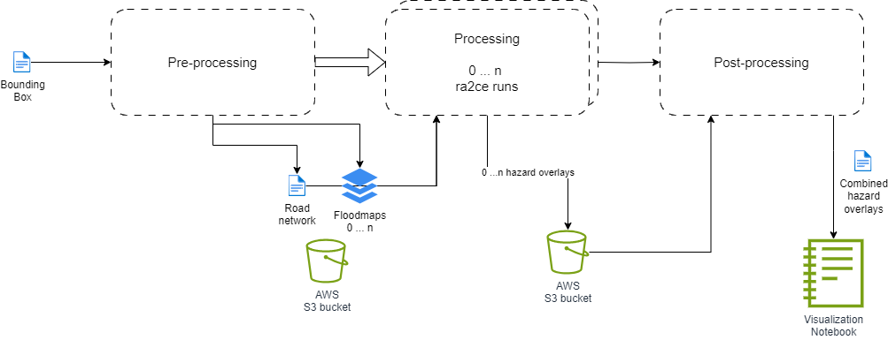

# User question 1

UQ.1: Which roads are most likely to get hit by flooding from this hurricane given its projected flood maps?

- __Input__: road extent (OSM), 100+ flood maps from SFINCS in Beira/Qualimane area and a RA2CE folder setup with .ini files.
- __Proposed workflow__: multiple flood maps – for every flood map a seperate RA2CE run - for every scenario seperate results – save the results in an efficient way – postprocess into meaningful results.
- __Expected output__: flood depths on edges for every scenario.
- __Expected post-processed results__: per edge an indication of ‘likelihood’ of flooding (e.g. in 90 / 100 scenario’s this edge gets hit (% hits)). 
- __Acceptance level__: Tackle user question 1 on Tuesday.
- Which questions for user questions 2,3,4 are also relevant for question 1?

The workflow defined for this user question is as follows:

| | 
|:--:| 
| *User Question 1: Workflow* |

## Input

- Collection of hazard files in `.tif` format.
- Boundary box (coordinates) of the network extent.
- ra2ce network configuratino file in `.ini` file.

## Pre-processing

### Re-projecting

It might be possible that we require to pre-process the hazard files due to a different projection than WGS-84.

This can be done either locally or "in the cloud".

### Creating the buckets

We create buckets online with each containing our network configuration, network extent and only one hazard file. This way we spread the computation of each hazard overlay for enhanced performance.

## Processing

### Running the hazard overlay

In each bucket, we do a simple ra2ce run by modifying the `NetworkConfigData.hazard.hazard_map` property so that instead of having 'n' defined hazard files, contains only the name of the available hazard file for its executing "bucket".

## Post-processing

### Unifying the outputs

Because we ran ra2ce with one container per hazard file, it means we have our output spread over different containers. We then unify all the available outputs and export its content into both a `.json` (geojson) and a `.feather` file.

## Visualizing

Last, we can now manually download the results ( `.json` and `.feather`) and visualize them locally.