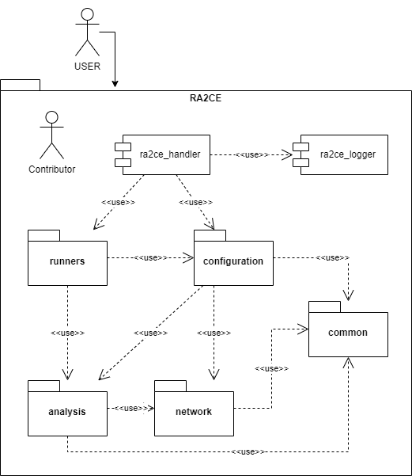

# RA2CE

This package is divided into different (sub-)packages, the most relevants being the following:

- `network`, this (sub-)package contains the logic to retrieve a normalized data structure capable of representing all the required properties of a network for its later analysis.
- `analysis`, this (sub-)package is responsible to analyze a network in of its different types (`direct` / `indirect`).
- `runners`, this (sub-)package encapsulates the logic to automatize an analysis of a ra2ce model.

## General class overview

A general overview of the package relationships can be seen in the following diagram.

| | 
|:--:| 
| *Ra2ce package overview* |