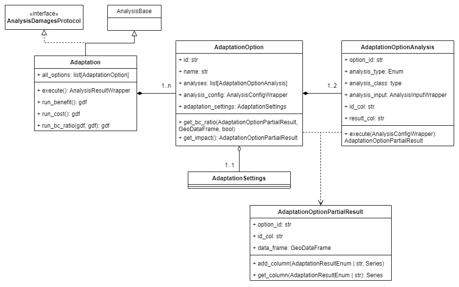

# Adaptation
The subpackage `ra2ce.analysis.adapatation` contains all classes related to an adaptation analysis.

An `Adaptation` analysis calculates the ratio between the benefits and the costs of given adaptation options on the infrastructure.
The `AdaptionOption`s are listed in an `AdaptationOptionCollection`, where the first entry is the `reference_option` (situation in which no adaptation is done).

The collection contains various properties that are relevant for the calculations:
- `time_horizon`: the period for which the analysis is done
- `discount_rate`: inflation correction on the cost
- `initial_frequency`: current expected frequency of the hazard
- `climate_factor`: correction on the frequency of the hazard due to climate changes
- `hazard_fraction_cost`: calculate the cost only for the impacted faction of the link

These properties are configured in `AnalysisConfigData.AnalysisSectionAdaptation`.

## Benefit calculation
The benefit of a certain adaptation option (`AdapatationOption`) is calculated by comparing the impact of an option with the impact of the reference option.

### Impact
The impact of an option is calculated by determining the damages and/or losses that are caused by a certain hazard.
Which losses analysis is run is determined by `AnalysisConfigData.AnalysisSectionAdaptation.losses_analysis`.

The configuration of the damages and the losses analyses are derived from their standard configuration in the section `AnalysisSectionDamages` and `AnalysisSectionLosses`, which are stored in `AdaptationOptionAnalysis` for a specific option.
One of these needs to be configured.

In `AdaptationOptionAnalysis.get_analysis_info` it can be found which analysis to run.
Note this logic resembles the logic in `AnalysisFactory`, which can't be used due to circular dependencies.
Here also a regex expression is given to find the right column in the analysis result.

The net present impact is calculated by summing the damages and/or the losses per link, taking into account the `initial_frequency` corrected by a `climate_factor`, and the `time_horizon` and `discount_rate`.

## Cost calculation
The cost of an adaptation is calculated per link in the network by multiplying the unit cost of an adaptation with the length of the link.
In case `hazard_fraction_cost` is True, the cost is multplied by the impacted fraction of the link.

### Unit cost
The unit cost (cost \[€\] per unit \[m\] of the infrastructure) is calculated from 2 components:
- contruction cost at a construction time interval
- maintenance cost at a maintenance time interval

To get the net present unit cost, the `time_horizon` and `discount_rate` are taken into account.

Both of these components can be omitted, assuming there is no construction or maintenance involved.

These components are configured per option in `AnalysisConfigData.AnalysisSectionAdaptationOption`, where also the **unique** id and the name of the adaptation are given.

## Remarks
The inputs to the damages (e.g. damage functions) and losses (e.g. resilience curves) analysis should be put in folder `input/{id}/{analysis}/input`, where `id` is the id of the `AdaptationOption` and analysis is the `config_value` of `AdaptationOptionAnalysis.analysis_type`.

If the adaptation workflow is run from the handler, the damages and losses analysis are run separately as well.