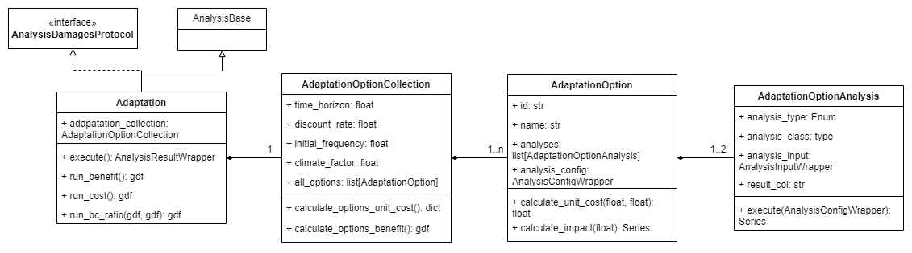

# Adaptation

The subpackage `ra2ce.analysis.adapatation` contains all classes related to an adaptation analysis.

An `Adaptation` analysis calculates the ratio between the benefits and the costs of given adaptation options on the infrastructure.
The different options are listed in an `AdaptationOptionCollection`, where the first entry is the `reference_option` (situation in which no adaptation is done).

The collection contains various properties that are relevant for the calculations:
- `time_horizon`: the period for which the analysis is done
- `discount_rate`: inflation correction on the cost
- `initial_frequency`: current expected frequency of the hazard
- `climate_factor`: correction on the frequency of the hazard due to climate changes

These properties are configured in `AnalysisConfigData.AnalysisSectionAdaptation`.

## Benefit calculation
The benefit of a certain adaptation option (`AdapatationOption`) is calculated by comparing the impact of an option with the impact of the reference option.

### Impact
The impact of an option is calculated by determining the damages and losses that are caused by a certain hazard. To calculate the damages, the `Damages` analysis is run on the network.
The losses are calculated by running either the `SingleLinkLosses` or `MultiLinkLosses` analysis on the network.
Which losses analysis is run is determined by `AnalysisConfigData.AnalysisSectionAdaptation.losses_analysis`.

The configuration of the damages and the losses analyses are derived from their standard configuration in the section `AnalysisSectionDamages` and `AnalysisSectionLosses` and are stored in `AdaptationOptionAnalysis` for a specific option.

## Cost calculation
The cost of an adaptation is calculated per link in the network by multiplying the unit cost of an adaptation with the length of the link.
The unit cost (cost \[€\] per unit \[m\] of the infrastructure) is calculated from 2 components:
- contruction cost at a certain time interval
- maintenance cost at a certain time interval

Both of these components can be omitted, assuming there is no construction or maintenance involved.

These components are configured per option in `AnalysisConfigData.AnalysisSectionAdaptationOption`, where also the **unique** id and the name of the adaptation are given.

## Remarks
The inputs to the damages (e.g. damage functions) and losses (e.g. resilience curves) analysis should be put in folder `input/{id}/{analysis}/input`, where `id` is the id of the `AdaptationOption` and analysis is the `config_value` of `AdaptationOptionAnalysis.analysis_type`.

If the adaptation workflow is run from the handler, the damages and losses analysis are run separately as well.